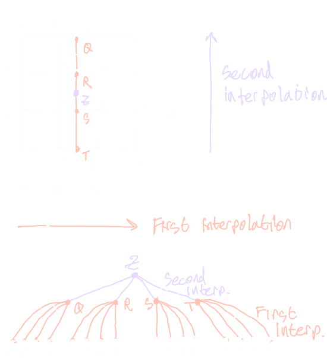
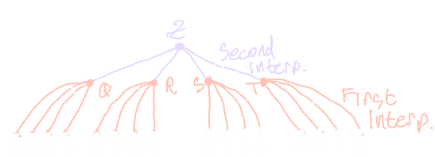

# 2025-11-10 InterpN: Fast Interpolation

[InterpN](https://github.com/jlogan03/interpn) 
is a low-latency numerical interpolation library for realtime and
bare-metal embedded systems, written in Rust.
It remains the first and only of its kind in this domain.

Because of the performance constraints of a bare-metal target, InterpN has
achieved excellent application-level throughput and found use in
scientific computing via
the [Rust crate](https://crates.io/crates/interpn) 
and [Python bindings](https://pypi.org/project/interpn/).

Edited 2025-11-12 to add the x86-64-v3/v4 reference CPUs and improve formatting on mobile.
Edited 2025-12-31 to update a plot and peak speedup number for version 0.9.1.

## Results

InterpN achieves up to 250x speedup over the state of the art (Scipy)
for N-dimensional interpolation.

--8<--
docs/blog/assets/2025-11-07/speedup_vs_dims_1_obs_linear.html
--8<--

Similar speedups are obtained for large batch inputs,
with more modest (about 10x) speedups for cubic methods.

--8<--
docs/blog/assets/2025-11-07/4d_throughput_vs_nobs_prealloc_linear.html
--8<--

--8<--
docs/blog/assets/2025-11-07/4d_throughput_vs_nobs_prealloc_cubic.html
--8<--

These benchmarks graciously exclude the cost of initialization of Scipy's methods,
which allocate, do a linear solve, and perform other preparation during initialization.

By contrast, InterpN can be called directly on a reference to the data at any time with no
initialization penalty.

Finally, InterpN produces about
[8 orders of magnitude less floating-point error](https://interpnpy.readthedocs.io/en/latest/perf/)
than Scipy.

## Motivation

Interpolation is one of the most common tasks in scientific computing
and realtime/embedded systems.

Between these two domains, usage falls into two broad categories

* Small batch / low latency (optimization, realtime, embedded)
* Large batch / high throughput (visualization, fluid/material property lookups, grid data remapping)

InterpN targets the first category, but excels in both.

## The Algorithm

The combination of low latency, high throughput, and bare-metal compatibility
is achieved through a (bounded) recursive algorithm.

The concept itself is easy: do 1D interpolation on one axis at a time.
After visiting each of the `N` dimensions, you arrive at the final interpolated value.

The trick to making it efficient is to formulate the data access as a tree of depth N
instead of as an N-cube:



This method extends to higher dimensions by deepening the tree, and
applies to linear as well as cubic methods by changing the degree of the tree
and the 1D interpolation kernel.

This algorithm is vaguely related to the recursive
[de Casteljau's algorithm](https://en.wikipedia.org/wiki/De_Casteljau%27s_algorithm)
and [de Boor's algorithm](https://en.wikipedia.org/wiki/De_Boor%27s_algorithm).
In practice, it looks nothing like either one and shares no implementation details.

The 1D cubic spline evaluation uses [Horner's method](https://en.wikipedia.org/wiki/Horner%27s_method)
to minimize the total number of FLOPs and roundoff events.

In an [earlier post](interpn.md/#2023-11-24-building-a-hypercube-interpolator),
I tabled the recursive algorithm to avoid heap allocation.
Since then, more careful thought resulted in the tree formulation.

## Performance Hygiene

There are some things we can do to improve performance without touching the code.

These settings will be used when building your crate directly as a binary,
Python extension library, or similar.

### Optimizations, codegen-units, and LTO

First, configure the release profile in `Cargo.toml`.

```
[profile.release]
codegen-units = 1       # Optimize the whole crate together
lto = true              # Reduces binary size + small speedup
overflow-checks = true  # Free reliability!
```

### x86 Instruction Sets

Next, configure compiler flags in `.cargo/config.toml`.

By default, rustc targets CPUs from 2001.
For both scientific computing and realtime systems, it's fair to target newer machines.

To target about 2008 onward,

```
[target.'cfg(any(target_arch = "x86_64", target_arch = "x64"))']
rustflags = ["-C", "target-feature=+fma"]  # incl. SSE4 and AVX
```

Or, for about 2013 onward,

```
[target.'cfg(any(target_arch = "x86_64", target_arch = "x64"))']
rustflags = ["-C", "target-cpu=x86-64-v3"]  # incl. AVX2 and FMA
```

In a few years, when AVX512 (released 2016) has become more common, this list might look like

```
[target.'cfg(any(target_arch = "x86_64", target_arch = "x64"))']
rustflags = ["-C", "target-cpu=x86-64-v4"]  # incl. AVX512
```
although, as of 2025, AVX512's performance effects remain controversial.

These settings allow rustc to produce modern 
[vector (SIMD) instructions](https://en.wikipedia.org/wiki/Single_instruction,_multiple_data)
for x86 processors. The rustc documentation contains the
[full list of available x86 instruction sets](https://doc.rust-lang.org/reference/attributes/codegen.html#x86-or-x86_64).

Next, we'll look at how to write code to use these for massive speedups.

## Vectorization Three Ways

Now that we've got vector instructions, let's use them.

### Primer

As a brief primer on vectorization: the term refers to the use of SIMD
(single instruction multiple data) aka vector instructions to perform multiple float
operations at once independent of threading.
Vectorization is associated with the benefit of reading from sequential and/or
cache-lane-aligned memory addresses for efficient reads from RAM, although in a
strict sense, this is a distinct benefit of the patterns used to produce vector instructions.
The combined effect of both is typically a 5-10x speedup.

Nick Wilcox's [auto-vectorizer tutorial](https://www.nickwilcox.com/blog/autovec/#auto-vectorization)
is an excellent recipe for what I'll call "Type 1" vectorization.

* Type 1 (numpy, ndarray, etc): simple loops performing one operation on each datum
* Type 2 (InterpN): complex loops performing as many operations as possible on each datum
* Type 3 (Strobe): array expressions on small stack buffers with large memory alignment

The third method is described in more detail in an earlier post about [Strobe](strobe.md).

All three methods rely on the autovectorizer and require careful elimination of bounds checks.

### Eliminating Allocation

For example, take the expression `a = b * c^2; d = b^2 + c^3; e = a + d;`.

In a Type 1 vectorized approach,

```rust
// With ndarrays b, c
let a = b * c.powi(2);          // Allocates 2 times
let d = b.powi(2) + c.powi(3);  // Allocates 3 times
let e = a + d;                  // Allocates again
```

Each individual operation is well-vectorized and readable, _but_

* ⚠️ This produces slow traffic back-and-forth to RAM
* ⚠️ Extra allocations increase latency and total RAM usage
* ⚠️ The compiler and CPU can only optimize one operation at a time
    * `c^2` is not reused between the calculation of `a` and `d`
    * `b^2` won't be pipelined alongside `c^2`
    * ...and so on. Even for such a small expression, there are many missed optimizations!
* ⚠️ Bounds checks are repeated for each operation

A Type 2 approach would look like this:

```rust
// With slices b, c
assert!(b.len() == c.len())      // Pull bounds check forward
let mut e = vec![0.0; b.len()];  // Allocate once

// Unidiomatic, but we checked bounds, so it's OK to index.
for i in 0..e.len() {
  let (bi, ci) = (b[i], c[i]);
  let a = bi * ci * ci;
  let d = bi * bi + ci * ci * ci;
  e[i] = a + d;
}
```

and produces higher overall throughput by resolving all those issues.

* ✅ Minimum possible RAM accesses and heap allocations
* ✅ Compiler automatically reuses duplicate values
* ✅ CPU can execute independent operations concurrently without threading
* ✅ Bounds checks are only performed once
* ✅ Compiler generates vector instructions
    * Both spanning sequential indices and within the scalar expression

Finally, to produce a Type 2 pattern, we don't actually write down the entire
scalar expression in a loop like that example. Instead, we can simply rely
on inlining to do it for us.

```rust
// ...
#[inline]
fn my_expr(b: f64, c: f64) -> f64 {
  let a = b * c * c;
  let d = b * b + c * c * c;
  e[i] = a + d;
}

// ...
for i in 0..e.len() {
  e[i] = my_expr(b[i], c[i]);
}
```

### Careful Branching & Cache-Locality

InterpN defers between 7 distinct cases for cubic interpolation:

```
out                     out
---|---|---|---|---|---|--- Grid
 2   2   3   3   3   2   2  Order of interpolant between grid points
 1                       1  Extrapolation with linearize_extrapolation
```

This is enabled by a conspicous benefit of the Type 2 pattern:
robustness to branching in the loop.

In a Type 1 pattern, branches in the loop disrupt autovectorization,
cause cache misses, and obliterate performance. This drives implementations
like Scipy's `pchip` to pre-calculate knot coefficients during initialization.

Meanwhile, branching (carefully) in a Type 2 pattern is _totally okay_
as long as all the data and procedures required for both branches
are present in cache, and the need to allocate and calculate coefficients during
initialization is eliminated.

## Fused Multiply-Add

FMA allows combining `a * x + b` into a single operation `a.mul_add(x, b)`
with a single roundoff event, increasing throughput and decreasing floating-point error.

### When to Use FMA

FMA is not available as a hardware instruction on all CPUs.
Sometimes, even when it is available (as with the Cortex M7 microcontroller),
the increased latency may be unacceptable.

As a rule of thumb, FMA is usually beneficial for desktop applications,
but usually detrimental for microcontrollers.

### How to Use FMA

To support the user of a library in choosing whether or not FMA is good for their
application, a feature flag in `Cargo.toml` that's not associated with any dependencies:

```
[features]
fma = []
```

Then, at each location that could benefit from hardware FMA,
use it behind a feature flag:

```rust
// Horner's method
#[cfg(not(feature = "fma"))]
let y = y0 + t * (c1 + t * (c2 + t * c3));

#[cfg(feature = "fma")]
let y = c3.mul_add(t, c2).mul_add(t, c1).mul_add(t, y0);
```

## A Brief Aside about libm

Some math functions in Rust defer to system math libraries and produce inconsistent behavior
between platforms. For functions like `sqrt`, `log`, and other transcendentals,
make sure to use `libm` for a pure-rust implementation that is much more consistent and reliable.

## Traversing Unrealized Trees

Recall the tree that we're traversing:



The key to eliminating allocation in this tree formulation is to recognize 
that **we never need to actually _build_ the tree**.

Two distinct evaluation patterns are used by InterpN to bypass fully realizing the tree:
[bounded recursion](#bounded-recursion) for large number of dimensions,
and [const-unrolling](#const-unrolling) otherwise.

### Bounded Recursion

We can traverse the tree by bounded recursion, using stack frames to automatically expand the
storage required to visit each node.

This allows us to realize the minimum storage to represent a path
through the tree in `N` dimensions with a footprint of size `F` (`O(F*N)`),
which is a massive improvement over realizing the entire cube (`O(F^N)`).

Pros

* ✅ `O(F*N)` storage
* ✅ Easy to relate to the interpolation method
* ✅ Quick to compile
* ✅ One function can support different numbers of dimensions

Cons

* ⚠️ Slow due to use of stack frames (still faster than Scipy, but could be better)
* ⚠️ Statically un-analyzable call stack due to recursion (not so good for embedded)
* ⚠️ The recursive function can't be fully inlined; we could be helping the compiler more

### Const-Unrolling

Alternatively, we can reformulate the recursion as a for-loop over a fixed number of dimensions `N`
using const generics and `crunchy::unroll!` to flatten the entire tree into a single stack frame
at compile-time.

Const-unrolling with a parametrized bound looks like this:

```rust
// With `const N: usize`
const { assert!(N < 5) };

crunchy::unroll! {
    for i < 5 in 0..N {
      // Loop expanded at compile-time
    }
}
```

Const-unrolling can be applied to the entire traversal of the dependency tree when evaluating an interpolation,
because for a given number of dimensions and footprint size, that tree always looks exactly the same.

Pros

* ✅ `O(F*N)` storage
* ✅ Very fast; compiler can optimize over the entire calculation in a single stack frame
* ✅ Statically-analyzable call stack
* ✅ Const indexing (everything except float math and index offsets happens at compile-time)

Cons

* ⚠️ Long compile times for large `N`
* ⚠️ Requires compiling for an exact number of dimensions
* ⚠️ Harder to relate to the interpolation method (it doesn't _look_ like a recursion)

## Profile-Guided Optimization

PGO is the practice of doing a two-pass build to allow the compiler to do optimizations
with some knowledge of how the program will actually be run. Speedups are typically
in the 20%-100% range, but can vary far outside that range.

InterpN's Python bindings ship with PGO for the most-common platforms:

* 🚀 Linux (x86_64 and aarch64)
* 🚀 MacOS (x86_64 and aarch64)
* 🚀 Windows (x64)

The procedure used by InterpN is
[very general](https://github.com/jlogan03/interpn/blob/6eea50c9382d48a66dd52dc51f93a27c4a84a290/.github/workflows/release-python.yml#L18),
and can be applied to nearly any Rust-Python project built with PyO3/Maturin.

### PGO for Rust Binaries

Jakub Beránek's [blog post](https://kobzol.github.io/rust/cargo/2023/07/28/rust-cargo-pgo.html)
provides an excellent introduction to PGO for Rust binaries, and his `cargo-pgo` tool
streamlines the process described there.

The workflow for Rust binaries is like so:

1. Build the Rust binary with PGO instrumentation
2. Run representative workloads using that binary to collect usage data
3. Combine multiple raw profiles into a single combined profile
4. Rebuild the binary using the profile to enhance compiler optimizations

### PGO for Python Extension Libraries

For a Python extension library, the procedure is similar:

1. Build the extension library with PGO instrumentation
2. Run a Python profile workflow
3. Combine raw profiles
4. Build a second time using the profile to optimize the extension library
5. Deploy to PyPI

For InterpN, steps 1 and 4 are implemented as minor edits to `maturin` actions workflow's `args` input:

```yaml
- name: Instrumented build
  uses: PyO3/maturin-action@v1
  with:
    target: ${{ matrix.platform.target }}
    args: --release --out dist --find-interpreter --verbose -- "-Cprofile-generate=${PWD}/scripts/pgo-profiles/pgo.profraw"
    manylinux: auto
```

then, having run the workload and merged profiles,

```yaml
- name: Optimized build
  uses: PyO3/maturin-action@v1
  with:
    target: ${{ matrix.platform.target }}
    args: --release --out dist --find-interpreter --verbose -- "-Cprofile-use=${{github.workspace}}/scripts/pgo-profiles/pgo.profdata" "-Cllvm-args=-pgo-warn-missing-function"
    manylinux: auto
```

### PGO's Sharp Edges

* LLVM version must match between
    * rustc used locally to generate the profiles
    * LLVM used to merge profiles
    * and rustc used during deployment
* PGO profiles are not portable between platforms
    * They won't cause a crash during build, but will silently have no effect
* PGO is _very_ sensitive to choice of profile workload
    * Don't profile against unit tests or benchmarks! This will likely make the program slower under real use
* PGO profiles must be passed in as an _absolute_ path; relative paths are not expanded by rustc
* No configuration in `Cargo.toml` or `.cargo/config.toml` can result in PGO being used automatically

As always, go carefully, but do go.

## Conclusion

### \#\[no-std\] Is Closely Related to Scientific Computing

no-std compatibility in scientific computing libraries may seem tangential to the task at hand,
but ultimately produces excellent performance, allows reusing the same code for embedded and applications,
and, as of recently, allows [reuse as a GPU kernel](https://github.com/Rust-GPU/rust-gpu) as well.

### This Is Not a One-Off

These techniques are not specific to interpolation,
and have been applied with successfully to signal processing, realtime controls,
analytic electromagnetics, fluid mechanics, structural mechanics, and computational geometry.

### Next Steps

* Thread parallelism with `rayon`
    * This is incredibly easy, but just hasn't been necessary yet
    * We'll use another core when we're done with the first one
* Cross-platform GPU kernel extension using `rust-gpu` and `wgpu`
    * Because it is no-std compatible, InterpN is already GPU-ready! Just needs some plumbing
* PGO for cross-compiled targets (via qemu? docker? self-hosted runners? TBD)
